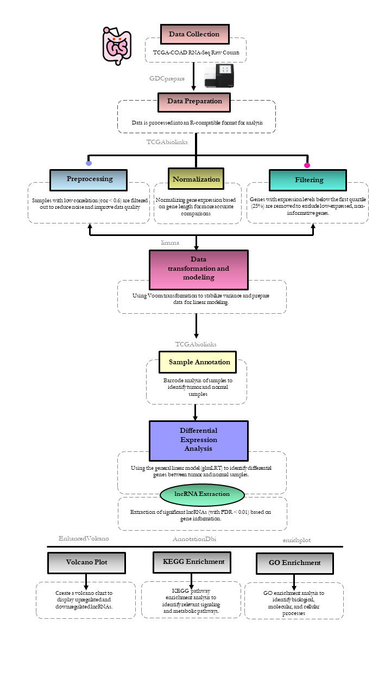

# Diagnostic lncRNA Signatures in Colorectal Cancer:  TCGA RNA-Seq Study
This pipeline focuses on identifying differentially expressed lncRNAs between tumor and normal samples from the TCGA-COAD cohort. 

## 1.Data Collection: 
RNA-Seq data for TCGA-COAD is retrieved from the GDC portal in raw count format (STAR aligner output).

## 2.Preprocessing: 
Samples with low correlation (cor < 0.6) are filtered out to reduce noise and improve data quality.

## 3.Voom Transformation: 
Voom transformation is applied to stabilize variance and prepare data for linear modeling.

## 4.Sample Annotation: 
Sample barcodes are parsed to classify samples as tumor or normal based on barcode structure.

## 5.Differential Expression Analysis (DEA): 
A generalized linear model (glmLRT) is applied to identify differentially expressed genes between tumor and normal samples.

## 6.lncRNA Extraction: 
Significant lncRNAs (FDR < 0.01) are extracted based on gene annotations from the list of DEGs.

## 7.Volcano Plot: 
A volcano plot is generated using EnhancedVolcano to visualize upregulated and downregulated lncRNAs.

## 8.Expression Labeling: 
lncRNAs are labeled as "upregulated" or "downregulated" based on log fold change (logFC) values.

## 9.GO Enrichment: 
Gene Ontology enrichment is conducted across Biological Process (BP), Cellular Component (CC), and Molecular Function (MF) categories.

# Required software
1. R (4.4.2)
2. RStudio version: 2024.12.0
3. TCGAbiolinks (2.36.0)
4. DT (0.33)
5. dplyr (1.1.4)
6. limma (3.64.0)
7. EnhancedVolcano (1.26.0)
8. ggplot2 (3.5.2)
9. DOSE (4.0.1)
10. org.Hs.eg.db (3.21.0)
11. clusterProfiler (4.16.0)
12. enrichplot (1.28.0)
    
